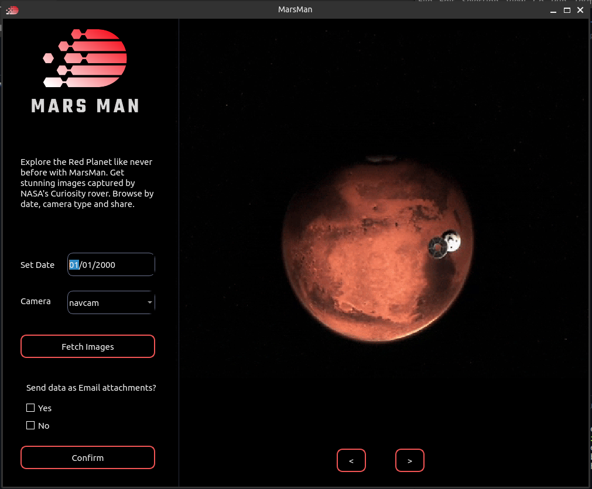
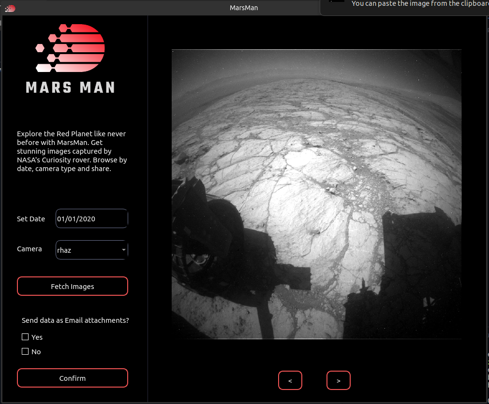
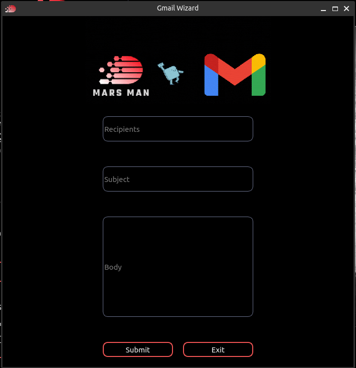
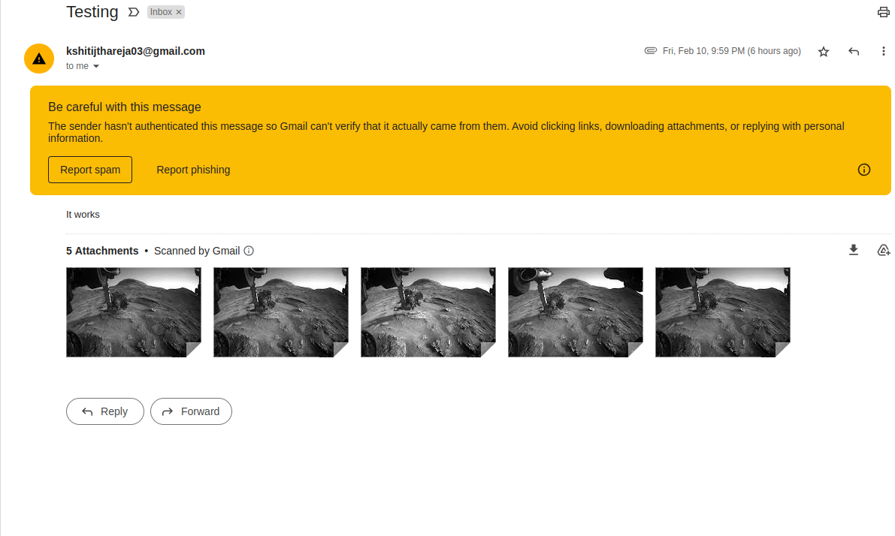

# MARS MAN

# Fetch Images from NASA's Curiosity Rover

## Introduction

Hello Earthlings. Myself Kshitij Thareja. 
Have you ever wondered what Mars actually looks like? How do scientists and space enthusiasts carry out their research related to the 'Red Planet'. There's a lot of data derived from rovers which are launched by various space research centers. One such rover is Curiosity, launched by NASA on 26 November, 2011.

This application fetches images from the Mars rover API, a facility provided by NASA. With a simple and user-friendly interface, you can easily browse through the images based on a specific date, and save or share photos with others.

## Getting Started

To get started, simply clone this repository and create a virtual environment in the cloned directory Then install the required packages from [requirements.txt](requirements.txt) file given in this repository.

`$ git clone https://github.com/KshitijThareja/TheMartianChronicles.git`

`$ cd TheMartianChronicles`

`$ python3 -m venv myvenv`

`$ source myvenv/bin/activate`

`$ pip3 install -r requirements.txt`
 
Then you can run gui.py to start the application. Don't forget to use your API key, which you can get from [NASA APIS](https://api.nasa.gov/)

Add the API key to line 395 of main_window.py file. 

`secret=str(os.getenv('SECRET'))`
You can put you key in place of the environment variable used here.

`secret="Your_API_Key"`

## UI of existing application

### Main window

### Image screen

### Email window

### Mail sent through application

### Working application

You can see how the GUI of the application works in the
[video given here](assets/working/application.webm)
